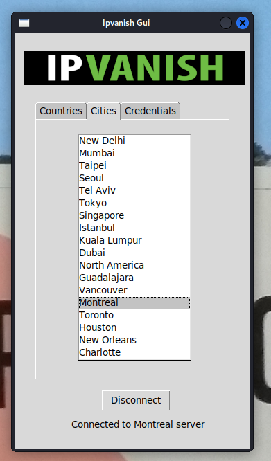

# IPVanish-Client

### IPVanish simple GUI for Linux/Debian

-----------------------------------------------------------------------

##### 02/07/22 - On Kali Linux/Debian OpenVPN version 2.6.0 is still under 'Testing' status. If using this version the client (or anything using ovpn configurations) will not work (i.e. 'key' value not being understood, dbus failures etc..). It's recommended to use OpenVPN 2.5.1, or revert back by downloading the appropriate .deb package.



Connecting to IPVanish is normally quite annoying in Debian/Linux. It requires manually adding a connection, loading the file, and entering the password. This is for **every single server** you want to connect to.

This GUI somewhat simplifies the process. 

Launch the script and it will do various things:

```
- Check if you have a '/Config/' folder where Ipvanish is located.
- Check if that folder is populated
- If you have no config files it will download them for you, after having created the appropriate folder.
- Will prompt for user-name and password, with 'echo-off'. 
```

The GUI is then launched, and a connection is chosen. ~~In the current version, it is only possible to select 'Cities'~~

Unfortunately the credentials is a text file stored in '/configs'/. 

That might change in the future. I see no real problem, unless you are on a shared-terminal or in an office. 

I don't have that problem: I share nothing and live in a cave, and I wrote this for myself after all.

----------------------------------------------------------------------------------------------------
**add to PATH, i.e.:**

```cp ~/Desktop/IPVanish-Client/ipvanish.py ~/Desktop/IPVanish-Client/ipvanish && rm ~/Desktop/IPVanish-Client/ipvanish.py```

```chmod +rwx ~/Desktop/IPVanish-Client/ipvanish```

```sudo mousepad ~/.bashrc (or zsh)```

**add this at the bottom of the file:**

```export PATH=$PATH:~/Desktop/IPVanish-Client/```

**now you can launch from terminal with:**

```ipvanish```

---------------------------------------------------------------------------------------------------

Requirements: 

**OpenVPN, i.e. (if not root):**

``` sudo -i ```

``` apt-get install openvpn```

**Works through nmcli, so Network Manager must be enabled, i.e.:**

```systemctl start NetworkManager```
```systemctl enable NetworkManager```

All packages are standard library.

Passwords are not outputted to terminal thanks to ```stdout=subprocess.DEVNULL``` and redirecting output to the linux toilet (they might be stored elsewhere in memory).

---------------------------------------------------------------------------------------------------

Where we are:

Current version is fully functional and code is a bit more structured. There is still quite a lot to do:

- Fix the generic North America, Europe and South America choices
- ~~Disconnect and delete connection~~	(26/07/22)
- ~~Update buttons and label~~			(26/07/22)
- ~~Add Credentials tab~~				(26/07/22)
- Add Settings tab
- General GUI style


