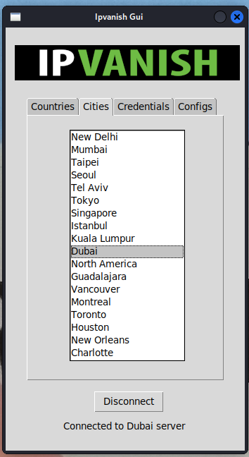

# IPVanish-Client

## IpVanish VPN Client for Linux





### About

Written in Python with Tkinter, this app will allow you to connect to a chosen IpVanish server in most linux distributions. 


Since Tkinter was used, the interface is fairly simple and was only implemented to simplify the connection process (i.e. without any bells-and-whistles).

### How to Connect 

Start the app through a terminal, for instance ```python3 ipvanish.py```, and download the necessary configuration files in the ```Configs``` tab first.

Once download has completed, enter your credentials and your sudo password in the ```credentials``` tab, and store both.

Pick a city or nation by clicking on a tab, and click on ```Connect```. 

Wait a second, and a connection should be established.

You can then disconnect from your current connection and repeat the process. 

### How it Works

The app works by using the ```subprocess``` module to create an OpenVPN connection through terminal commands. 

As such, it requires the user to acquire superuser privileges by entering and storing the system's sudo password in the ```Credentials``` tab. The password will need to be entered everytime the app starts, as the password is not stored.

The systemd-resolved service is then used to set dns and various other options. Again, this requires administrative privileges.

Finally, sysctl.conf will be accessed to set/unset variable ```net.ipv6.conf.all.disable_ipv6```.

### Note   

OpenVPN and systemd-resolved should be installed on your linux system.

The ```tabs``` module iterates through the system's network interfaces. Most commonly, these are named ```eth```, ```wlan``` etc...

The VPN interface should be named 'tun0'.

If problems occurr, it is likely due to these settings. Please raise an issue should this be the case.

Once launched, download ovpn configurations, entering valid credentials, connecting and disconnecting to a server of your choice.

### Installation and Requirements

**add to PATH, i.e.:**

```cp ~/Desktop/IPVanish-Client/ipvanish.py ~/Desktop/IPVanish-Client/ipvanish && rm ~/Desktop/IPVanish-Client/ipvanish.py```

```chmod +rwx ~/Desktop/IPVanish-Client/ipvanish```

```sudo mousepad ~/.bashrc (or zsh)```

**add this at the bottom of the file:**

```export PATH=$PATH:~/Desktop/IPVanish-Client/```

**now you can launch from terminal with:**

```ipvanish```

---------------------------------------------------------------------------------------------------

Requirements: 

**OpenVPN, i.e. (if not root):**

``` sudo -i ```

```apt-get install systemd-resolved```

``` apt-get install openvpn```

All packages are standard library.


